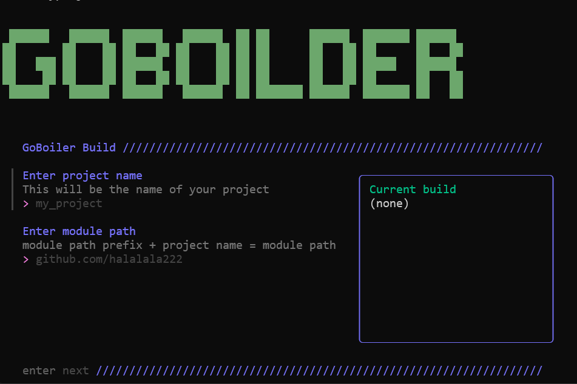
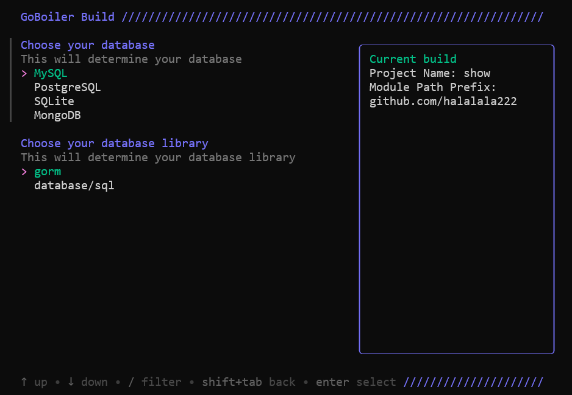
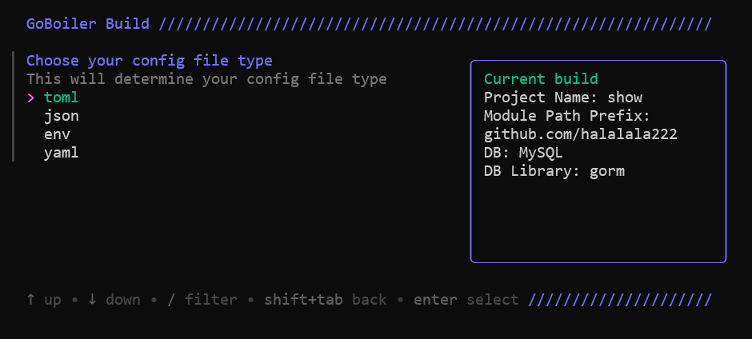
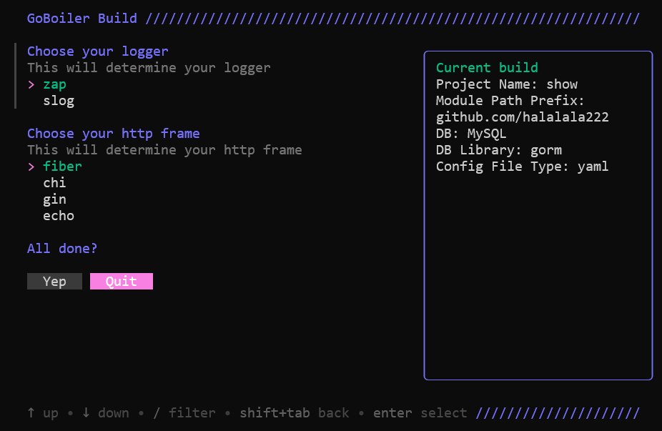
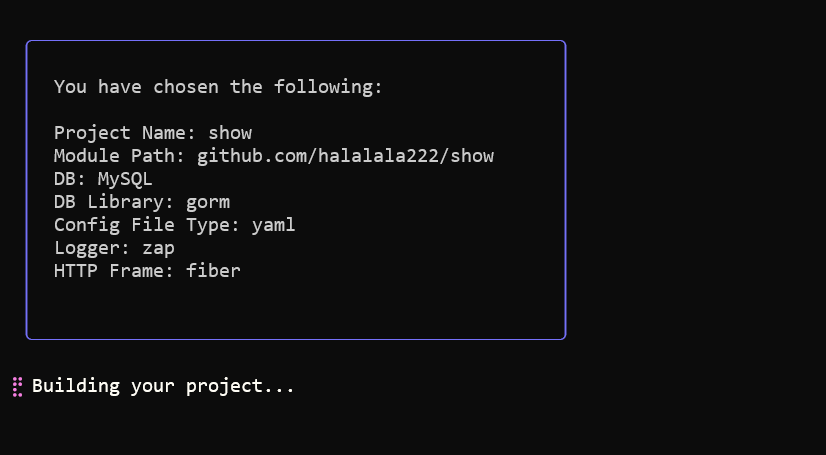
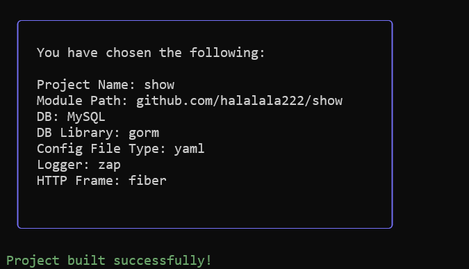

## GoBoilder

> A tool to help you generate a unified project architecture, based
> on [Go Clean Arch](https://github.com/bxcodec/go-clean-arch)
> 
> Thanks to [charmbracelet/huh](https://github.com/charmbracelet/huh) to build TUI forms easily.
> 
> Inspired by the [go-blueprint](https://github.com/Melkeydev/go-blueprint) project

## Usage

```bash
./goboilder
```

## Support

### HTTP Framework

- [x] [Gin](https://github.com/gin-gonic/gin)
- [x] [Echo](https://github.com/labstack/echo)
- [x] [Fiber](https://github.com/gofiber/fiber)
- [x] [Chi](https://github.com/go-chi/chi)

### Database & DB Library

- MySQL
    - [x] [Gorm](https://github.com/go-gorm/gorm)
    - [x] [database/sql](https://pkg.go.dev/database/sql)
- PostgreSQL
    - [x] [Gorm](https://github.com/go-gorm/gorm)
    - [x] [database/sql](https://pkg.go.dev/database/sql)
- SQLite
    - [x] [Gorm](https://github.com/go-gorm/gorm)
    - [x] [database/sql](https://pkg.go.dev/database/sql)
- MongoDB
    - [x] [Mongo-go-driver](https://github.com/mongodb/mongo-go-driver)

### Config File Type

- [x] JSON
- [x] YAML
- [x] TOML
- [x] ENV

### Logger

- [x] [Zap](https://github.com/uber-go/zap)
- [x] [Slog](https://pkg.go.dev/log/slog)

## Usage Example
<p align="center">
  
</p>
<p align="center">
  
</p>
<p align="center">
  
</p>
<p align="center">
  
</p>
<p align="center">
  
</p>
<p align="center">
  
</p>